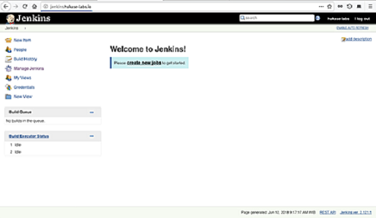

# **Jenkins Vagrant Machine**

#### Jenkins, an automation pipeline tool:

To use the Jenkins on the VM follow the set up steps bellow:

Fork this repo and move into the directory on your terminal and enter the following on your terminal:
```
vagrant up
```
Now you should be able to get onto the VM using:
```
vagrant ssh
```
To know your inside the VM you should see your terminal prompt change to something similar too:
```
vagrant@ubuntu-xenial:~$
```
Now go to the following directory inside the VM:
```
/var/lib/jenkins
```
You will need to change the file permissions of the directory "secrets", to do this enter on your terminal:
```
sudo chmod 755 secrets/
```
This gives read, write and execute permissions to the owner of the file and read and execute permissions to everyone else.

To setup and use Jenkins you must enter the initial password into initial page of setting up Jenkins. Now move into the "secrets" folder and type the following in your terminal:
```
sudo cat initialAdminPassword
```
Highlight and copy what is returned from the terminal.

Now go to your browser and in the address bar type:
```
jenkins.vm:8080
```
You should be taken to a page entitled "Unlock Jenkins", paste the initial admin password into the space provided and click continue.  
You now should be taken to The "Customize Jenkins" page, choose to install the suggested plugins or to install plugins of your choice. Next, you should see "getting started" page where Jenkins installs everything it needs including Jenkins plugins.  
After installation is complete you will be taken to create your first admin user on the "Create First Admin User" page, once complete you are then taken to "instance configuration" where you enter the URL you want to use to access your Jenkins account.  
Now open up your internet browser and go to your Jenkins URL and you should see the Jenkins dashboard with "Welcome to Jenkins!" welcome message.    


